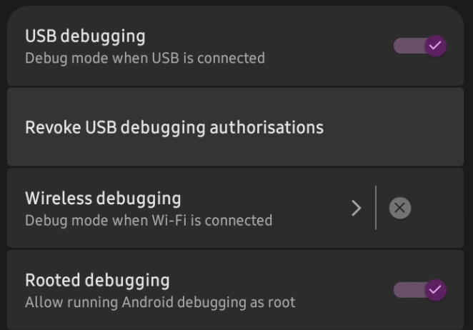
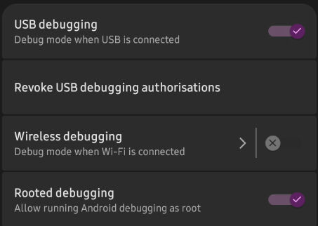
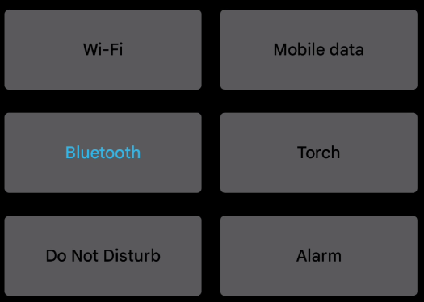
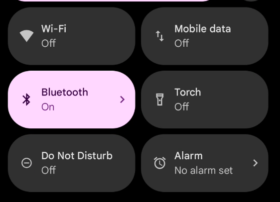

# DroidCSS

LSPosed module for my modifications to Android 14

# Features
### TODO

* Revert Material Components switches (e.g in Settings) to the older ones 
* Replace the Quick Settings tiles with regular buttons

# Screenshots
#### Also TODO

## Switches in Settings

| With the module enabled  | Without the module enabled |
:-------------------------:|:-------------------------:
  |  

## Quick Settings tiles

| With the module enabled  | Without the module enabled |
:-------------------------:|:-------------------------:
  |  

# FAQ

* Q: Why is only Android 14 supported? 
* A: Because that's what I'm using. You can run the module on later versions but it won't be guaranteed to work.

# Credits

[Iconify](https://github.com/Mahmud0808/Iconify) for the Xposed wrapper
